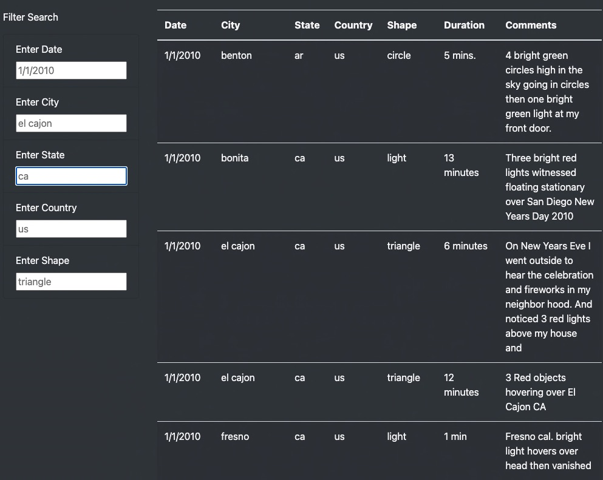
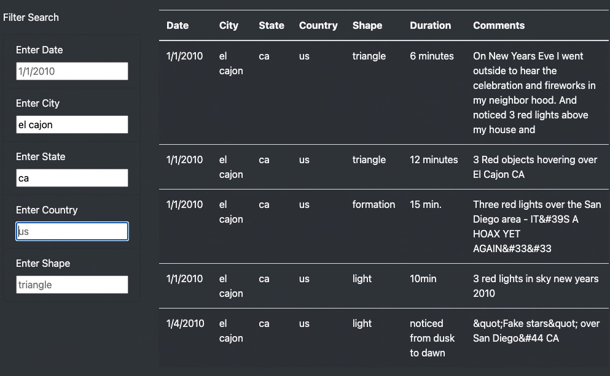
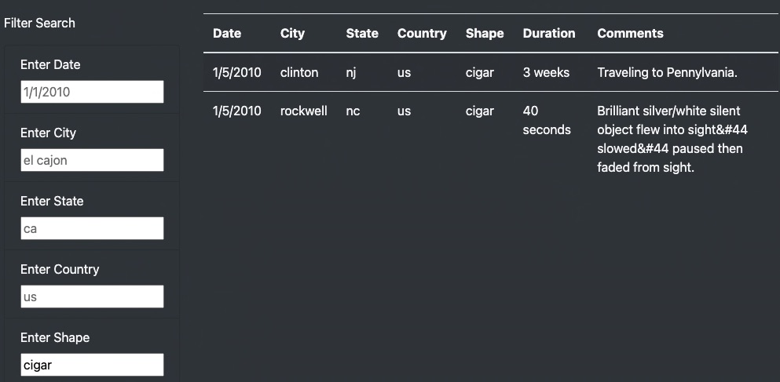
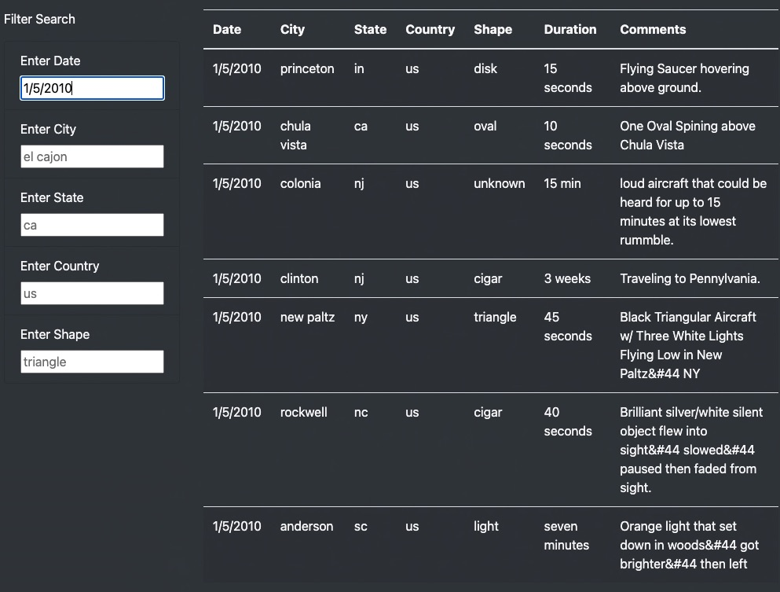

# UFO Finder

## Overview

This app allows users to filter our database of UFO sightings based on multiple criteria at the same time. This criteria includes information such as the date of the sighting, the city, state, and or country where any UFO has been spotted plus the general shape of the UFO or UFO formation.

## Results

Some examples of searches a user can perform will be shown in this section. These examples will attempt to show how the searches could be used by a user for a specific purpose.

By default, all sightings will be shown. The image below shows a sampling of these sightings:

In this sampling we can see that a few sightings were in California. Let's narrow down the list and choose a city within California.

### Search by City, State

- Enter 'el cajon' in the 'Enter City' input field.

- Enter 'ca' in the 'Enter State' field.

- Enter tab or click in anywhere outside of the input field on the same page.

The results should be as follows:

Note that there were several sightings on the first of January and then again there was one on January 4th.

Clear the city and state fields before performing the next search by shape.

### Search by Shape

More recently, one of the most intriguing shapes in UFOlogy has been the cigar shape. In 2015, there even was a TV special episode on this shape alone!

https://www.imdb.com/title/tt13197676/plotsummary?ref_=tt_ov_pl

In our data we performed a search on this shape as follows:

- Enter the word 'cigar' in the 'Enter Shape' input field.

- Enter tab or click in anywhere outside of the input field on the same page.

This search came up with 2 locations on the same day in the mid-atlantic region of the US. Could this have been a real UFO?

Clear the search to show all sightings by erasing the text in the shape input field.

### Search by Date

The current data is limited to sightings that occurred during the time period between 1/1/2010 and 1/13/20. Enter the date 1/5/2010 and the following results should be displayed:

From this search we can see that a couple of sightings took place in NJ on the same day. Clinton is west of Colonia which is directly headed towards Pennsylvania as noted in the comments.

Could these two sightings be the same UFO? Was this UFO real?

Ufologists say "Yes!"

## Summary

The site is easy for any user to quickly find a lot of information on any particular UFO sighting. Any combination of search fields can be entered to narrow the search. Clearing all input fields will display all of the sightings.

There are a couple of features that could be incorporated in the future to help make the app even easier to find the best spots for sighting UFO's.

### Current Drawbacks

- The table shows all of the sightings found on one page. This requires the user to scroll down the entire page in order to get to the end of the data.

- New searches require the user to make sure all the fields are set properly.

- There are hundreds of sighthngs to search through.

- Currently, the data is primarily from 2010. There is no easy way of adding more sightings into the current database.

- The placeholders in each field are too pronounced making it look like data has been entered.

### Possible Future Enhancements

- Modify the table to be srollable. This will ensure that the search criteria remains in view as the user scrolls down the table.

- Add a button to clear all search criteria at once. This will allow the user to quickly reset the search criteria to prevent searches that don't make sense. For example, a city that is not in the same state as the previous search would give results that may not be correct or may not have any sightings. While, some browsers have the capability to clear a form, this functionality can be improved greatly with a click of a button.

- Add word completion and/or menus to allow the user to quickly select the city, state or country. Formatting help with entering a date and a menu to choose from the limited number of shapes.

- A feature to find cities within a certain distance from a starting point may help the user gather better information about one particular sighting.

- Add the ability to search on a range of dates.

- Add the ability to either enter more sightings manually or to use an API or other method of downloading data from a site such as MUFON which allows users from around the world to continually add new sightings.

- Modify the text fields so the placeholders are less pronounced either by changing them to a lighter shade or by using a darker color for the text font.
